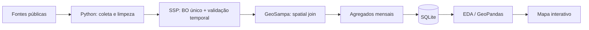

# Smart Sampa: vigilância urbana e desigualdade territorial em São Paulo

> Projeto de portfólio em Data Science que constrói e integra dados públicos sobre a expansão do Smart Sampa e sua relação espacial com roubos e furtos de celulares.

**Status:** em desenvolvimento · pipeline SSP-SP + GeoSampa validado com dados oficiais de 2025.

## Por que este projeto?

Em vez de partir de um dataset pronto, o projeto reconstrói uma base analítica a partir de fontes públicas heterogêneas. A proposta é demonstrar um fluxo compacto envolvendo **pesquisa e coleta**, **data cleaning**, **SQL**, **análise exploratória**, **geoprocessamento** e, na etapa final, **visualização interativa**.

A pergunta atual é deliberadamente descritiva:

> **Como a cobertura do Smart Sampa se distribui pelas subprefeituras de São Paulo e como essa distribuição se relaciona espacialmente com roubos e furtos de celulares?**

O projeto não interpreta associação espacial como efeito causal das câmeras.

## Dados e estágio atual

| Base | Cobertura | Status |
|---|---|---|
| Câmeras Smart Sampa por subprefeitura | 32 subprefeituras · set/2025 | Integrada |
| População | Censo 2022 · 32 subprefeituras | Integrada |
| Área territorial | 2025 · 32 subprefeituras | Integrada |
| Histórico municipal/regional de câmeras | snapshots 2023–2026 | Integrado |
| Histórico subprefeitural | Mooca e Itaim Paulista | Parcial |
| Celulares subtraídos — SSP-SP | fatos de 2025, arquivos 2025+2026 | Pipeline oficial validado |
| Limites administrativos — GeoSampa | 32 subprefeituras e 96 distritos | Pipeline oficial validado |

A fotografia das 32 subprefeituras soma **40.000 câmeras**, exatamente o total municipal anunciado para setembro de 2025.

Na SSP-SP, a execução reproduzível identificou **161.145 BOs únicos elegíveis** de roubo/furto de celular ocorridos em 2025. Desses, **133.051 (82,57%)** possuem coordenadas válidas e **132.933 (82,49% do total)** foram atribuídos espacialmente aos polígonos oficiais do GeoSampa. Toda análise territorial é, portanto, rotulada como referente à **parcela geocodificada** da base.

## Arquitetura



Os microdados com endereços e coordenadas ficam fora do Git. O repositório versiona somente agregados territoriais e métricas de qualidade.

## Estrutura do repositório

```text
.
├── .github/workflows/       # testes e construção reproduzível dos agregados
├── data/
│   ├── raw/                 # dados pequenos versionados + proveniência
│   ├── external/            # downloads/microdados locais; gitignored
│   └── processed/           # agregados e tabelas analíticas
├── database/
│   ├── schema.sql
│   └── queries.sql
├── docs/
│   ├── methodology.md
│   └── roadmap.md
├── notebooks/
│   └── 01_eda_cameras.ipynb
├── src/
│   ├── build_database.py
│   ├── download_geosampa.py
│   ├── ingest_ssp_cellphones.py
│   ├── spatial_join_crimes.py
│   ├── make_figures.py
│   └── validate_data.py
├── tests/
├── requirements.txt
└── README.md
```

## Pipeline SSP-SP + GeoSampa

O arquivo anual da SSP corresponde ao **ano de registro do BO**, não necessariamente ao ano da ocorrência. Para reconstruir 2025, o pipeline lê os arquivos de 2025 e 2026 e depois filtra `DATA_OCORRENCIA_BO`.

```bash
python src/ingest_ssp_cellphones.py \
  --download-years 2025 2026 \
  --occurrence-years 2025
python src/download_geosampa.py
python src/spatial_join_crimes.py
```

Principais decisões:

- normalização de `S.PAULO` / `São Paulo` / `SAO PAULO`;
- deduplicação por `NOME_DELEGACIA + ANO_BO + NUM_BO`;
- manutenção da maior `VERSAO` do BO;
- contagem por BO único;
- território definido pela coordenada do fato, não pelo bairro textual ou delegacia;
- leitura de XLSX grandes com `calamine` e retry para falhas transitórias do endpoint público.

O pipeline produz:

```text
data/processed/ssp_cellphones_by_subpref_month.csv
data/processed/ssp_cellphones_by_district_month.csv
data/processed/ssp_geocoding_quality_month.csv
```

## SQL no projeto

O SQLite serve como camada funcional de integração, não como complexidade artificial. O schema contém câmeras, território e agregados mensais de criminalidade, além de views para análise descritiva.

`database/queries.sql` demonstra `JOIN`, CTE, ranking e window functions.

## Indicadores

Atualmente são calculados:

- `cameras_por_10_mil_hab_pop2022`;
- `cameras_por_km2_area2025`.

Na próxima etapa, eles serão cruzados com a quantidade **geocodificada** de celulares subtraídos em 2025 e com indicadores normalizados pela população residente.

## Limitações centrais

1. A contagem de câmeras por subprefeitura é uma fotografia de setembro de 2025; não há ainda série mensal completa por território.
2. Cerca de 17,5% dos BOs elegíveis da SSP não têm coordenadas válidas para o mapa.
3. População residente é um denominador imperfeito em áreas centrais com grande circulação diária.
4. A alocação de câmeras é endógena: áreas com mais crimes podem receber mais monitoramento.
5. A rede inclui câmeras privadas integradas e seu estoque pode variar.

Assim, a análise atual trata **distribuição e associação espacial**, não eficácia causal do Smart Sampa.

## Fontes principais

- Metrópoles — câmeras por subprefeitura em setembro/2025, a partir de resposta via LAI.
- Prefeitura de São Paulo / SMUL-GEOINFO / IBGE — população e áreas territoriais.
- Prefeitura de São Paulo / Smart Sampa e Participa+ — snapshots da expansão da rede.
- SSP-SP — microdados anuais de celulares subtraídos.
- GeoSampa — limites oficiais de subprefeituras e distritos via WFS.

URLs e datas de acesso estão versionadas em `data/raw/sources.csv`.

## Próximos passos

1. versionar os agregados oficiais de 2025 no `main`;
2. produzir o dataset analítico Smart Sampa × criminalidade por subprefeitura;
3. fazer a EDA comparativa;
4. construir a visualização interativa para GitHub Pages;
5. avaliar se uma LAI para série histórica territorial das câmeras justifica uma segunda etapa longitudinal.

## Licença

Código sob licença MIT. Os dados permanecem sujeitos aos termos e condições de suas respectivas fontes.
