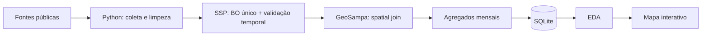

# Smart Sampa: vigilância urbana e desigualdade territorial em São Paulo

> Projeto de portfólio em Data Science que constrói e integra dados públicos sobre a expansão do Smart Sampa e sua relação espacial com roubos e furtos de celulares.

**Status:** em desenvolvimento · pipeline SSP-SP + GeoSampa validado · primeira EDA comparativa concluída.

## Pergunta

> **Como a cobertura do Smart Sampa se distribui pelas subprefeituras de São Paulo e como essa distribuição se relaciona espacialmente com roubos e furtos de celulares?**

O projeto parte de fontes públicas heterogêneas, em vez de um dataset pronto, e demonstra pesquisa/coleta, ETL, SQL, geoprocessamento, análise exploratória e comunicação de dados.

## Dados integrados

| Base | Cobertura | Status |
|---|---|---|
| Smart Sampa por subprefeitura | 32 subprefeituras · set/2025 | Integrada |
| População | Censo 2022 | Integrada |
| Área territorial | 2025 | Integrada |
| SSP-SP — celulares subtraídos | ocorrências de 2025 | Agregada por subprefeitura e distrito |
| GeoSampa | 32 subprefeituras + 96 distritos | Spatial join validado |
| Histórico territorial de câmeras | parcial | Próxima frente de pesquisa |

A fotografia territorial do Smart Sampa soma **40.000 câmeras** em setembro de 2025.

O ETL da SSP-SP identificou **161.145 BOs únicos elegíveis** de roubo/furto de celular ocorridos em 2025. Desses, **133.051 (82,57%)** possuem coordenadas válidas e **132.933 (82,49%)** foram atribuídos aos polígonos oficiais do GeoSampa. Entre os casos com coordenada válida, o spatial join alcançou **99,91%**.

## Resultado preliminar

Na comparação transversal das 32 subprefeituras, a associação entre **câmeras por 10 mil habitantes** e **BOs geocodificados por 100 mil habitantes** é positiva:

- Pearson: **0,7704**
- Spearman: **0,7379**


O sinal permanece positivo com outras escalas:

| Comparação | Pearson | Spearman |
|---|---:|---:|
| Câmeras absolutas × BOs absolutos | 0,7767 | 0,8248 |
| Câmeras/10 mil hab. × BOs/100 mil hab. | 0,7704 | 0,7379 |
| Câmeras/km² × BOs/km² | 0,7644 | 0,8087 |
| Câmeras/10 mil hab. × roubos/100 mil hab. | 0,8130 | 0,6661 |
| Câmeras/10 mil hab. × furtos/100 mil hab. | 0,7439 | 0,7460 |

Dividindo as subprefeituras em quartis de cobertura, a mediana de BOs geocodificados por 100 mil habitantes cresce de **484,65** no quartil de menor cobertura para **2.015,32** no de maior cobertura.


### Interpretação correta

O resultado **não demonstra que câmeras aumentem crimes, sejam ineficazes ou deixem de coibir furtos**. A análise atual é transversal. Uma explicação plausível é seleção/endogeneidade: áreas com maior circulação e criminalidade podem justamente receber mais câmeras.

Uma formulação compatível com os dados é:

> **Não há, nesta análise transversal, evidência de uma associação espacial negativa entre maior cobertura do Smart Sampa e registros de roubo/furto de celulares. O padrão observado é o oposto: territórios com mais câmeras tendem também a concentrar mais BOs geocodificados.**

A análise completa e suas limitações estão em [`docs/preliminary_analysis.md`](docs/preliminary_analysis.md).

## Arquitetura



Os microdados com endereços e coordenadas ficam em `data/external/` e não são versionados. O Git contém somente agregados territoriais e métricas de qualidade.

## Estrutura

```text
.
├── .github/workflows/       # CI e construção reproduzível dos agregados
├── data/
│   ├── raw/                 # fontes pequenas e proveniência
│   ├── external/            # microdados locais; gitignored
│   └── processed/           # agregados e datasets analíticos
├── database/                # schema + consultas SQL
├── docs/                    # metodologia, análise e roadmap
├── notebooks/
│   ├── 01_eda_cameras.ipynb
│   └── 02_eda_camera_crime.ipynb
├── reports/figures/
├── src/
│   ├── ingest_ssp_cellphones.py
│   ├── download_geosampa.py
│   ├── spatial_join_crimes.py
│   ├── build_database.py
│   └── analyze_camera_crime.py
└── tests/
```

## Reproduzir

```bash
python -m venv .venv
# Windows: .venv\Scripts\activate
# Linux/macOS: source .venv/bin/activate
pip install -r requirements.txt
pytest -q
python src/build_database.py
python src/analyze_camera_crime.py
```

Para reconstruir os agregados diretamente das fontes oficiais:

```bash
python src/ingest_ssp_cellphones.py --download-years 2025 2026 --occurrence-years 2025
python src/download_geosampa.py
python src/spatial_join_crimes.py
```

## SQL

O SQLite funciona como camada real de integração entre território, câmeras e criminalidade. `database/queries.sql` inclui `JOIN`, CTE, rankings e window functions; não foi acrescentado apenas como tecnologia de showcase.

## Limitações centrais

1. A distribuição completa de câmeras é um snapshot de setembro de 2025, não uma série mensal de exposição.
2. Aproximadamente 17,5% dos BOs elegíveis não têm coordenadas válidas e ficam fora da análise territorial.
3. População residente é denominador imperfeito em áreas de grande circulação diária, como Sé e Pinheiros.
4. A alocação de câmeras é endógena: áreas com mais crimes podem receber mais monitoramento.
5. O sistema inclui câmeras privadas integradas, cujo estoque pode variar.
6. BOs representam registros policiais, não necessariamente toda a incidência real.

## Próximo passo

O próximo produto será o **mapa interativo refinado para GitHub Pages**, inspirado na lógica de exploração territorial do Mapa da Desigualdade. Em paralelo, o projeto continuará buscando uma série `subprefeitura × mês × câmeras ativas`; somente com essa exposição temporal será razoável avançar para um desenho longitudinal sobre deterrência.

## Licença

Código sob licença MIT. Os dados permanecem sujeitos aos termos e condições de suas respectivas fontes.
