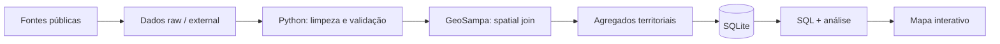

# Smart Sampa: vigilância urbana e desigualdade territorial em São Paulo

> Projeto de portfólio em Data Science que constrói e integra dados públicos sobre a expansão do Smart Sampa e crimes patrimoniais, com foco em roubos e furtos de celulares.

**Status:** em desenvolvimento · pipeline territorial pronto · ETL SSP-SP + GeoSampa implementado e testado · execução completa dos microdados oficiais pendente.

## Por que este projeto?

Em vez de partir de um dataset pronto, o projeto reconstrói uma base analítica a partir de fontes públicas heterogêneas. A proposta é demonstrar um fluxo compacto envolvendo **pesquisa e coleta**, **data cleaning**, **SQL**, **análise exploratória**, **geoprocessamento** e, na etapa final, **visualização interativa**.

A primeira pergunta é deliberadamente descritiva:

> **Como a cobertura do Smart Sampa se distribui territorialmente em São Paulo, e como essa distribuição se relaciona com os registros de roubo e furto de celulares?**

O projeto não trata associação estatística como evidência causal sem um desenho de pesquisa adequado.

## Dados e estágio atual

| Base | Cobertura | Status |
|---|---|---|
| Câmeras Smart Sampa por subprefeitura | 32 subprefeituras · set/2025 | Integrada |
| População | Censo 2022 · 32 subprefeituras | Integrada |
| Área territorial | 2025 · 32 subprefeituras | Integrada |
| Histórico municipal/regional de câmeras | snapshots 2023–2026 | Integrado |
| Histórico subprefeitural | Mooca e Itaim Paulista | Parcial |
| Celulares subtraídos — SSP-SP | XLSX anuais 2017–2026 | ETL implementado; execução completa pendente |
| Limites administrativos — GeoSampa | 32 subprefeituras e 96 distritos | Downloader + spatial join implementados |

A fotografia das 32 subprefeituras soma **40.000 câmeras**, exatamente o total municipal anunciado para setembro de 2025. A proveniência e a data de referência de cada observação são preservadas.

## Arquitetura



O SQLite não é necessário pelo volume atual dos dados. Ele é usado para tornar explícita a **integração relacional entre fontes** e manter SQL como parte funcional do pipeline.

## Estrutura do repositório

```text
.
├── data/
│   ├── raw/                 # dados pequenos versionados + proveniência
│   ├── processed/           # tabelas derivadas/agregadas
│   └── external/            # criado localmente; ignorado pelo Git
├── database/
│   ├── schema.sql
│   └── queries.sql
├── docs/
│   ├── methodology.md
│   ├── ssp_geospatial_stage.md
│   └── roadmap.md
├── notebooks/
│   └── 01_eda_cameras.ipynb
├── src/
│   ├── build_database.py
│   ├── download_geosampa.py
│   ├── ingest_ssp_cellphones.py
│   ├── spatial_join_crimes.py
│   ├── make_figures.py
│   └── validate_data.py
├── tests/
│   ├── test_ssp_transform.py
│   └── test_spatial_join.py
├── requirements.txt
└── README.md
```

## Como reproduzir a base atual

```bash
python -m venv .venv
# Windows: .venv\Scripts\activate
# Linux/macOS: source .venv/bin/activate
pip install -r requirements.txt

pytest -q
python src/validate_data.py
python src/build_database.py
python src/make_figures.py
```

Depois, abra `notebooks/01_eda_cameras.ipynb`.

## Pipeline SSP-SP + GeoSampa

O portal da SSP publica arquivos anuais no padrão:

```text
CelularesSubtraidos_{ANO}.xlsx
```

Um cuidado importante: o ano do arquivo é o **ano de registro do BO**. Como um fato de dezembro pode ser registrado em janeiro, para analisar 2025 o pipeline pode ler também o arquivo de 2026 e filtrar depois por `DATA_OCORRENCIA_BO`.

```bash
python src/ingest_ssp_cellphones.py \
  --download-years 2025 2026 \
  --occurrence-years 2025

python src/download_geosampa.py
python src/spatial_join_crimes.py
```

O ETL:

1. aceita variantes de município como `S.PAULO`, `São Paulo` e `SAO PAULO`;
2. usa `NOME_DELEGACIA + ANO_BO + NUM_BO` como chave do BO;
3. mantém a maior `VERSAO` quando há retificações;
4. conta um BO uma única vez;
5. valida latitude/longitude;
6. atribui distrito e subprefeitura pelas coordenadas e pelos polígonos oficiais do GeoSampa — não pelo texto de `BAIRRO`.

Os microdados e intermediários com endereço/coordenadas ficam em `data/external/` e **não são versionados**. Apenas os agregados mensais por território são candidatos a commit.

## SQL no projeto

`database/queries.sql` inclui consultas com:

- `JOIN` entre dimensões e snapshots;
- cálculo de cobertura per capita e densidade espacial;
- `CTE`;
- `RANK()` e outras window functions;
- participação acumulada das subprefeituras no estoque de câmeras.

Exemplo:

```sql
SELECT
    subprefeitura,
    area_km2,
    cameras_2025_09,
    cameras_por_km2_area2025
FROM vw_subpref_cameras_2025_09
ORDER BY cameras_por_km2_area2025 DESC;
```

## Indicadores atuais

- `cameras_por_10_mil_hab_pop2022`;
- `cameras_por_km2_area2025`.

Eles **não medem efetividade do programa**. Diferenças podem refletir integração de câmeras privadas, centralidade urbana, comércio, população flutuante e critérios operacionais.

## Fontes principais

- **Metrópoles** — contagem completa das câmeras por subprefeitura em setembro/2025, obtida pelo veículo via LAI.
- **Prefeitura de São Paulo / SMUL-GEOINFO / IBGE** — população e áreas territoriais.
- **Prefeitura de São Paulo / Smart Sampa / Participa+** — expansão e snapshots do programa.
- **SSP-SP** — microdados anuais de celulares subtraídos.
- **GeoSampa** — limites oficiais de subprefeituras e distritos via WFS.

URLs e datas de acesso estão versionadas em `data/raw/sources.csv`.

## Limitações atuais

1. Ainda não há uma série temporal completa `subprefeitura × mês × câmeras`.
2. Os agregados em cinco regiões reportados pelo Smart Sampa não foram equiparados automaticamente à regionalização administrativa, pois as contagens não se reconciliam.
3. A população usada é do Censo 2022, enquanto a fotografia de câmeras é de 2025.
4. O pipeline SSP+GeoSampa está implementado, mas os arquivos oficiais completos ainda precisam ser executados para medir cobertura das coordenadas e taxa real do spatial join.
5. Relações entre cobertura de câmeras e criminalidade serão tratadas como **associações**, não como causalidade.

## Próximos passos

1. Executar os XLSX oficiais SSP-SP e as camadas WFS do GeoSampa.
2. Auditar coordenadas ausentes/inválidas e taxa de associação territorial.
3. Produzir `subprefeitura × mês × roubo/furto` e `distrito × mês × roubo/furto`.
4. Integrar os agregados ao SQLite.
5. Construir a primeira análise Smart Sampa × celulares subtraídos.
6. Publicar um mapa interativo refinado via GitHub Pages.

## Licença

Código sob licença MIT. Os dados permanecem sujeitos aos termos e condições de suas respectivas fontes.
