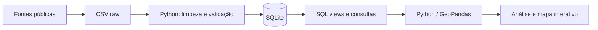

# Smart Sampa: vigilância urbana e desigualdade territorial em São Paulo

> Projeto de portfólio em Data Science para construir, integrar e explorar dados públicos sobre a expansão do Smart Sampa e sua relação com crimes patrimoniais — com foco futuro em roubos e furtos de celulares.

**Status:** em desenvolvimento · etapa atual: construção e validação da base territorial.

## Por que este projeto?

Em vez de partir de um dataset pronto, o projeto reconstrói uma base analítica a partir de fontes públicas heterogêneas. A proposta é demonstrar um fluxo compacto de trabalho envolvendo **coleta**, **data cleaning**, **modelagem relacional em SQL**, **análise exploratória**, **geoprocessamento** e, na etapa final, **visualização interativa**.

A pergunta inicial é deliberadamente descritiva:

> **Como a cobertura do Smart Sampa se distribui pelas subprefeituras de São Paulo?**

A etapa seguinte investigará se essa distribuição acompanha a geografia e a evolução de roubos e furtos de celulares. O projeto não tratará associação estatística como evidência causal sem um desenho de pesquisa adequado.

## Dados já integrados

| Base | Cobertura | Status |
|---|---|---|
| Câmeras Smart Sampa por subprefeitura | 32 subprefeituras · set/2025 | Integrada |
| População | Censo 2022 · 32 subprefeituras | Integrada |
| Área territorial | 2025 · 32 subprefeituras | Integrada |
| Histórico municipal/regional de câmeras | 2023–2026, snapshots | Integrado |
| Histórico subprefeitural | Mooca e Itaim Paulista, snapshots | Parcial |
| Celulares subtraídos — SSP-SP | 2017–2026 | Localizada; próxima etapa |
| Geometrias — GeoSampa | distritos/subprefeituras | Localizadas; próxima etapa |

A fotografia das 32 subprefeituras soma **40.000 câmeras**, exatamente o total municipal anunciado para setembro de 2025. O projeto preserva a fonte e a data de referência de cada observação.

## Arquitetura



O banco não é necessário pelo volume dos dados; ele é usado para tornar explícita a **integração relacional entre fontes** e manter SQL como parte funcional do pipeline.

## Estrutura do repositório

```text
.
├── data/
│   ├── raw/                 # fontes transcritas/estruturadas
│   └── processed/           # tabelas derivadas
├── database/
│   ├── schema.sql
│   ├── queries.sql          # consultas SQL de showcase
│   └── smart_sampa.sqlite
├── docs/
│   ├── methodology.md
│   ├── roadmap.md
│   └── data_quality.json
├── notebooks/
│   └── 01_eda_cameras.ipynb
├── reports/figures/
├── src/
│   ├── build_database.py
│   ├── ingest_ssp_cellphones.py
│   ├── make_figures.py
│   └── validate_data.py
├── requirements.txt
└── README.md
```

## Como reproduzir

```bash
python -m venv .venv
# Windows: .venv\Scripts\activate
# Linux/macOS: source .venv/bin/activate
pip install -r requirements.txt
python src/validate_data.py
python src/build_database.py
python src/make_figures.py
```

Depois, abra `notebooks/01_eda_cameras.ipynb`.

## SQL no projeto

O arquivo `database/queries.sql` inclui consultas que demonstram:

- `JOIN` entre dimensões e snapshots;
- cálculo de cobertura per capita e densidade espacial;
- `CTE`;
- `RANK()` e outras window functions;
- participação acumulada das subprefeituras no estoque de câmeras.

Exemplo:

```sql
SELECT
    subprefeitura,
    area_km2,
    cameras_2025_09,
    cameras_por_km2_area2025
FROM vw_subpref_cameras_2025_09
ORDER BY cameras_por_km2_area2025 DESC;
```

## Primeiros indicadores

Os indicadores atuais combinam:

- câmeras conectadas em setembro de 2025;
- população do Censo 2022;
- área oficial das subprefeituras em 2025.

Dois indicadores exploratórios já são calculados:

- `cameras_por_10_mil_hab_pop2022`;
- `cameras_por_km2_area2025`.

Esses indicadores **não medem efetividade do programa**. Diferenças de cobertura podem refletir integração de câmeras privadas, centralidade urbana, comércio, população flutuante, critérios operacionais e outros fatores.

## Fontes principais

- **Metrópoles** — contagem das câmeras por subprefeitura em setembro/2025, obtida pelo veículo via LAI.
- **Prefeitura de São Paulo / SMUL-GEOINFO / IBGE** — população do Censo 2022 por subprefeitura.
- **Prefeitura de São Paulo / SMUL-GEOINFO** — áreas territoriais oficiais de 2025.
- **Prefeitura de São Paulo / Smart Sampa** — snapshots municipais e regionais da expansão do sistema.
- **Participa+** — snapshots adicionais de Mooca e Itaim Paulista.
- **SSP-SP** — bases anuais de celulares subtraídos, a serem integradas.

URLs e datas de acesso estão versionadas em `data/raw/sources.csv`.

## Limitações atuais

1. Ainda não há uma série temporal completa `subprefeitura × mês × câmeras`.
2. Os agregados em cinco regiões publicados pelo Smart Sampa não foram equiparados automaticamente às regiões administrativas, porque as contagens não se reconciliam.
3. A população utilizada é a do Censo 2022, enquanto a fotografia de câmeras é de 2025.
4. A análise de criminalidade ainda não foi incorporada.

## Próximos passos

A próxima entrega integrará os microdados da SSP-SP e as geometrias oficiais do GeoSampa. O produto final previsto é um **mapa interativo de São Paulo**, publicado via GitHub Pages, com filtros temporais e territoriais e documentação explícita das limitações metodológicas.

## Licença

Código sob licença MIT. Os dados permanecem sujeitos aos termos e condições de suas respectivas fontes.
