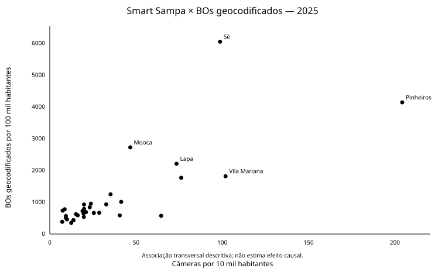
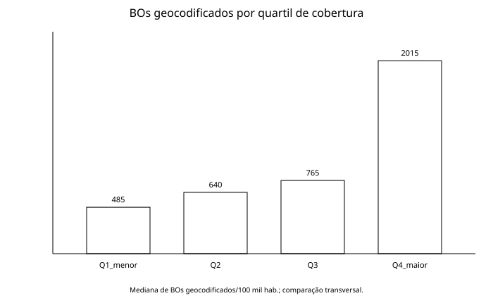

# Análise preliminar — Smart Sampa × roubos e furtos de celulares (2025)

## Escopo desta etapa

Esta é uma **análise transversal e descritiva** das 32 subprefeituras de São Paulo. Ela combina:

- fotografia de **40.000 câmeras do Smart Sampa em setembro de 2025**;
- população do Censo 2022 e área territorial oficial;
- BOs de roubo/furto de celulares ocorridos em 2025 na base da SSP-SP;
- associação territorial feita por latitude/longitude do fato e polígonos oficiais do GeoSampa.

A análise busca responder uma pergunta restrita:

> **Territórios com maior cobertura do Smart Sampa apresentam níveis menores ou maiores de BOs geocodificados de roubo/furto de celulares?**

Ela **não** responde, ainda, se as câmeras reduziram crimes após sua instalação.

## Qualidade e cobertura da base SSP-SP

O ETL identificou **161.145 BOs únicos elegíveis** de roubo/furto de celular ocorridos em 2025 no município de São Paulo.

| Etapa | BOs | % dos elegíveis |
|---|---:|---:|
| BOs elegíveis | 161.145 | 100,00% |
| Coordenada válida | 133.051 | 82,57% |
| Atribuídos a uma subprefeitura | 132.933 | 82,49% |
| Atribuídos a um distrito | 132.933 | 82,49% |

Entre os BOs que possuem coordenada válida, **99,91%** foram associados com sucesso a uma subprefeitura/distrito. A cobertura de coordenadas foi relativamente estável ao longo de 2025, variando de aproximadamente **81,85% a 83,35%** por mês.

Por isso, todos os indicadores territoriais de criminalidade deste projeto são explicitamente denominados **BOs geocodificados**. Os aproximadamente 17,5% sem coordenada válida não podem ser atribuídos com segurança a uma unidade territorial e não são redistribuídos por bairro textual ou delegacia.

## Resultado principal

A relação observada entre **câmeras por 10 mil habitantes** e **BOs geocodificados de roubo/furto de celulares por 100 mil habitantes** é positiva:

- **Pearson: 0,7704**
- **Spearman: 0,7379**

Ou seja: nesta fotografia espacial, as subprefeituras com maior cobertura de câmeras tendem também a apresentar maior concentração de registros geocodificados de subtração de celulares.



O padrão permanece positivo quando mudamos a forma de normalização:

| Comparação | Pearson | Spearman |
|---|---:|---:|
| Câmeras absolutas × BOs absolutos | 0,7767 | 0,8248 |
| Câmeras/10 mil hab. × BOs/100 mil hab. | 0,7704 | 0,7379 |
| Câmeras/km² × BOs/km² | 0,7644 | 0,8087 |
| Câmeras/10 mil hab. × roubos/100 mil hab. | 0,8130 | 0,6661 |
| Câmeras/10 mil hab. × furtos/100 mil hab. | 0,7439 | 0,7460 |

Isso é útil como teste de robustez **descritivo**: o sinal positivo não depende apenas de uma única escolha de escala.

## Comparação por quartis de cobertura

Dividindo as 32 subprefeituras em quatro grupos de oito, de acordo com câmeras por 10 mil habitantes:

| Quartil de câmeras | Mediana câmeras/10 mil hab. | Mediana BOs geocodificados/100 mil hab. |
|---|---:|---:|
| Q1 — menor cobertura | 9,34 | 484,65 |
| Q2 | 19,28 | 639,81 |
| Q3 | 27,10 | 764,70 |
| Q4 — maior cobertura | 74,83 | 2.015,32 |

A mediana de BOs geocodificados por 100 mil habitantes no quartil de maior cobertura é aproximadamente **4,2 vezes** a do quartil de menor cobertura.



Novamente, isso descreve coexistência espacial; não mede o que teria acontecido sem as câmeras.

## Territórios que mais influenciam a leitura

Sé e Pinheiros combinam alta cobertura de câmeras e alta concentração de BOs. Mooca, Lapa, Vila Mariana e Santo Amaro também aparecem nas posições superiores das duas distribuições.

Ao excluir **Sé, Pinheiros, Vila Mariana e Lapa** de uma análise de sensibilidade, a relação continua positiva:

- Pearson: **0,5933**
- Spearman: **0,6169**

Portanto, o sinal não é produzido exclusivamente por esses quatro territórios. Ainda assim, fatores de centralidade urbana permanecem uma explicação importante.

## Sensibilidade temporal

Como o dado de câmeras é uma fotografia de setembro de 2025, foi feita uma checagem adicional restringindo os BOs a **setembro–dezembro de 2025**. A associação continua positiva:

- Pearson: **0,8117**
- Spearman: **0,6873**

Isso não transforma a comparação em um desenho antes/depois: não temos uma série mensal completa do estoque de câmeras por subprefeitura e a composição do sistema pode mudar ao longo do período.

## O que podemos concluir agora

Uma formulação adequada para esta etapa é:

> **Não há, nesta análise transversal, evidência de uma associação espacial negativa entre maior cobertura do Smart Sampa e registros de roubo/furto de celulares. O padrão observado é o oposto: territórios com mais câmeras tendem também a concentrar mais BOs geocodificados.**

Esse resultado **não permite concluir** que as câmeras sejam ineficazes, que aumentem crimes ou que não tenham efeito dissuasório.

A hipótese de causalidade reversa é especialmente plausível:

> maior concentração de crimes / circulação → maior prioridade de monitoramento → maior número de câmeras.

Também há outros fatores que podem produzir simultaneamente alta cobertura e alta criminalidade registrada.

## Limitações que impedem uma conclusão causal

1. **Endogeneidade da implantação:** câmeras podem ser direcionadas justamente aos locais com maior demanda de segurança.
2. **Snapshot de exposição:** temos a distribuição completa das câmeras apenas em setembro de 2025, e não o estoque mensal por subprefeitura.
3. **População flutuante:** a taxa por residentes tende a ser problemática em áreas como Sé e Pinheiros, que recebem grande fluxo diário de não residentes.
4. **Câmeras privadas integradas:** parte relevante do estoque do Smart Sampa reflete adesão de condomínios e estabelecimentos privados, não apenas decisão direta de alocação pública.
5. **Geocodificação incompleta:** 82,49% dos BOs elegíveis entraram na análise territorial.
6. **Registro policial ≠ incidência real:** BOs dependem também de comportamento de registro e outros fatores institucionais.
7. **Temporalidade:** crime acumulado no ano e estoque de câmeras em setembro não constituem um desenho de tratamento.

## Próximo salto metodológico

Para testar a ideia de **deterrência**, o dado mais importante passa a ser uma série do tipo:

```text
subprefeitura | mês | câmeras ativas
```

Idealmente desde o início da implantação do Smart Sampa. Com ela poderemos construir um painel:

```text
subprefeitura | mês | câmeras | roubos_celular | furtos_celular | controles
```

A partir desse painel será possível testar se **a mudança na cobertura dentro de uma mesma subprefeitura** é acompanhada por mudança posterior na criminalidade, controlando diferenças fixas entre territórios e efeitos temporais comuns. Essa etapa é muito mais adequada para avaliar a hipótese de que o aumento de câmeras coíbe — ou não — os crimes analisados.
